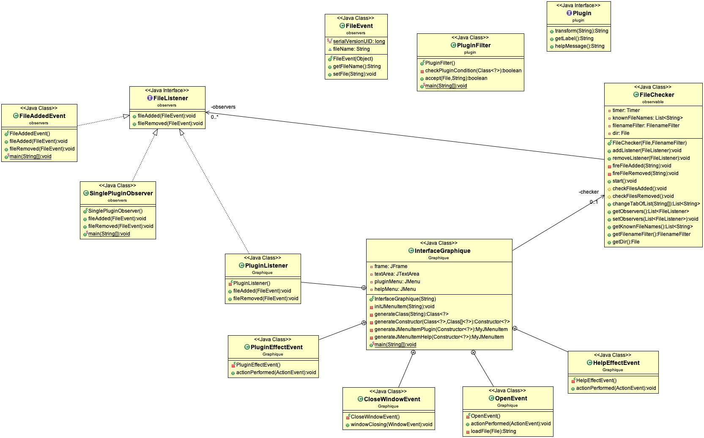

LESTIENNE Florian
CADET Florent

PLUGIN PROJECT
==============

## Introduction
Ce depôt correspond au projet plugin réalisé dans le cadre de la matière coo. Ici est expliqué comment lancé le programme et nous expliquerons les différents éléments de conception mis en place

## How To

* Génerer la javadoc: À la racine du projet -> mvn javadoc:javadoc -> Trouvez la javadoc dans le repertoire /target/docs

* Génerer le projet: mvn package

* Lancer le projet: Se placer dans le repertoire target puis lancer : java -classpath classes:extensions Graphique.InterfaceGraphique &

* Observer les différents événements en supprimant ou en ajoutant un plugin du repertoire available dans extensions/plugins.

## Niveau conception

Niveau conception, nous avons respecté la conception du projet, c'est à dire la mise en place du design pattern observer/observable afin de "surveiller" le contenu d'un fichier contenant des plugins. Une fois un plugin ajouté, nous pouvons sans rallumer le programme, utiliser ce plugin. En supprimant un plugin, il sera impossible d'utiliser ce plugin. Nous avons également établi une interface graphique afin d'observer au mieux le comportement du programme. De ce fait nous avons du réflechir à la meilleure conception possible afin de générer un projet open close et qui respecte les principes vu en cours.

## UML du Plugin Project

~                            
